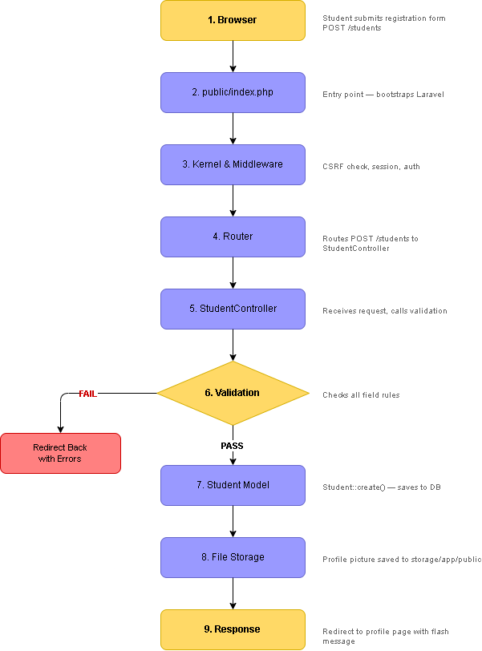
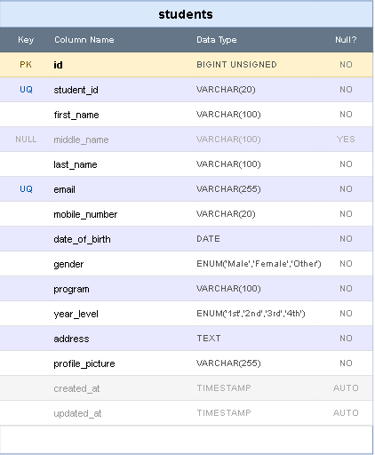
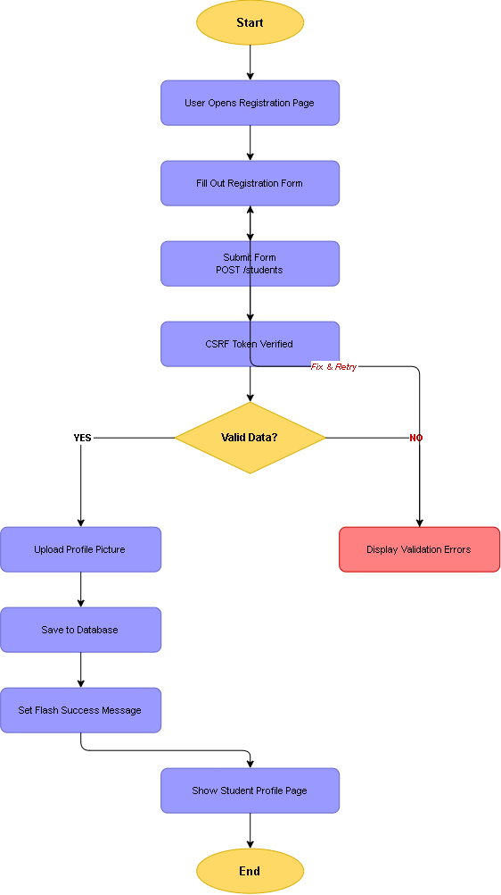

# Student Registration System
**ITST 302 – Client-Server Technologies | Week 4 Mini Project 03**

---

## Project Title
Student Registration System with Laravel Forms, Validation, and File Upload

---

## Introduction

Most systems we interact with daily — whether it's enrolling in a university, signing up for a bank account, or registering at a hospital — start with a registration form. Behind that simple form is a whole system making sure the data entered is correct, secure, and stored properly.

This project is a **Student Registration System** built using Laravel. The goal is to create a working registration module where students can fill out a form, upload a profile picture, and have their information saved into a MySQL database. The system validates all inputs before saving anything and shows proper feedback — whether the registration succeeded or something went wrong.

**Why validation matters:**
Submitting a form without proper validation is like leaving a door unlocked. Bad data gets in, duplicates pile up, and security weakens. Server-side validation makes sure that even if someone tries to bypass client-side checks, the backend still enforces the rules.

**Why this is relevant in enterprise systems:**
Every large-scale software — enrollment systems, HR platforms, hospital management tools — has a registration module at its core. The techniques used here (form handling, validation, file upload, database integration) are the same ones used in real-world Laravel projects.

---

## Objectives

Here's what I was able to accomplish through this project:

- Built a student registration form using Laravel Blade templates
- Processed form submissions using a dedicated `StudentController`
- Applied server-side validation rules to prevent bad data from being saved
- Set up flash messages to notify users whether registration succeeded or failed
- Handled profile picture uploads and stored them securely using Laravel Storage
- Designed and created the `students` database table using Laravel Migrations
- Documented the whole process in this README
- Maintained version control using Git with meaningful commit messages throughout development

---

## Laravel Request Lifecycle

When the registration form is submitted, here's what actually happens behind the scenes — from the moment the user clicks Submit to the moment they see the student profile page.



The request starts at the **Browser**, goes through `public/index.php` which bootstraps Laravel, passes through the **Kernel and Middleware** (where CSRF is checked), hits the **Router** which maps it to `StudentController`, then goes through **Validation**. If validation fails, it redirects back with errors. If it passes, the **Student Model** saves the record, **File Storage** handles the picture, and finally the **Response** redirects to the student profile with a flash message.

| Stage | What Happens |
|---|---|
| Browser | User submits the registration form via POST |
| public/index.php | Entry point — bootstraps the Laravel application |
| Kernel & Middleware | CSRF token verified, session and auth middleware runs |
| Router | Matches the route and dispatches to `StudentController@store` |
| StudentController | Receives the request, triggers validation |
| Validation | Checks all fields against defined rules |
| Student Model | `Student::create()` saves the record to the database |
| File Storage | Profile picture saved to `storage/app/public` |
| Response | Redirects to student profile page with a success flash message |

---

## Validation Rules

```php
$request->validate([
    'student_id'      => 'required|unique:students',
    'first_name'      => 'required|string|max:100',
    'last_name'       => 'required|string|max:100',
    'email'           => 'required|email|unique:students',
    'mobile_number'   => 'required|numeric',
    'date_of_birth'   => 'required|date',
    'gender'          => 'required',
    'program'         => 'required',
    'year_level'      => 'required',
    'address'         => 'required|string',
    'profile_picture' => 'required|image|mimes:jpg,jpeg,png|max:2048',
]);
```

I added these rules because each one protects something specific:

- **`required`** — makes sure no field is left blank, which prevents incomplete records from being saved
- **`unique:students`** — stops the same student ID or email from being registered twice
- **`email`** — rejects anything that doesn't follow proper email format
- **`numeric`** — makes sure the mobile number contains only digits, no letters or symbols
- **`image|mimes:jpg,jpeg,png`** — only allows actual image files to be uploaded, which prevents someone from uploading a dangerous script disguised as a file
- **`max:2048`** — limits uploads to 2MB so the server doesn't get overloaded with huge files

---

## Database Design

The `students` table was created using a Laravel migration. Here's the full table structure:



The table uses `id` as the primary key with auto-increment. `student_id` and `email` both have unique constraints to prevent duplicate entries. `middle_name` is the only nullable field since not all students have one. `gender` and `year_level` use ENUM types to restrict values to valid options only.

**Migration code:**

```php
Schema::create('students', function (Blueprint $table) {
    $table->id();
    $table->string('student_id', 20)->unique();
    $table->string('first_name', 100);
    $table->string('middle_name', 100)->nullable();
    $table->string('last_name', 100);
    $table->string('email')->unique();
    $table->string('mobile_number', 20);
    $table->date('date_of_birth');
    $table->enum('gender', ['Male', 'Female', 'Other']);
    $table->string('program', 100);
    $table->enum('year_level', ['1st', '2nd', '3rd', '4th']);
    $table->text('address');
    $table->string('profile_picture');
    $table->timestamps();
});
```

---

## Registration Flowchart



The flowchart shows the full registration process — from the user opening the page, filling out the form, submitting it, going through CSRF verification and validation, and then either showing validation errors or saving the record, uploading the picture, and showing the student profile page.

---

## Screenshots

| # | Screenshot | Description |
|---|---|---|
| 1 | `screenshots/01-registration-form.png` | The registration form |
| 2 | `screenshots/02-validation-errors.png` | Validation errors showing on the form |
| 3 | `screenshots/03-flash-success.png` | Success flash message after registration |
| 4 | `screenshots/04-uploaded-image.png` | Profile picture displayed after upload |
| 5 | `screenshots/05-student-profile.png` | Student profile page |
| 6 | `screenshots/06-database-records.png` | MySQL database with saved records |
| 7 | `screenshots/07-project-structure.png` | VS Code project structure |
| 8 | `screenshots/08-github-repository.png` | GitHub repository |
| 9 | `screenshots/09-terminal-output.png` | Terminal showing artisan commands |
| 10 | `screenshots/10-browser-output.png` | Browser output |

---

## Problems Encountered

### Problem 1: Images Not Showing After Upload
After successfully uploading a profile picture, the image wasn't displaying on the student profile page — the browser was returning a 404 error even though the file path was saved correctly in the database.

### Problem 2: Validation Errors Not Appearing
Submitting the form with missing fields redirected back correctly, but no error messages were showing below the input fields.

### Problem 3: Migration Error on Column Length
Running `php artisan migrate` threw an error about the index key being too long, which happened because of MySQL's default string length setting.

---

## Solutions

### Solution 1: Running the Storage Link Command
The problem was that `storage/app/public` wasn't publicly accessible yet. I ran:

```bash
php artisan storage:link
```

This created a symbolic link from `public/storage` to `storage/app/public`. I also updated the Blade template to use `asset('storage/' . $student->profile_picture)` instead of a raw path.

### Solution 2: Adding `@error` Directives in Blade
I was missing the `@error` blocks in the form. Adding these below each input field fixed it:

```blade
@error('first_name')
    <p class="text-red-500 text-sm mt-1">{{ $message }}</p>
@enderror
```

I also double-checked that `@csrf` was inside the form tag.

### Solution 3: Setting Default String Length
I added this inside the `boot()` method of `AppServiceProvider.php`:

```php
use Illuminate\Support\Facades\Schema;

Schema::defaultStringLength(191);
```

This resolved the migration error and the table was created successfully after that.

---

## Reflection

Before this project, I thought building a registration form was just about putting together input fields and saving data. I didn't really think much about what happens between the form submission and the actual database insert — but this project made that whole process very clear to me.

The biggest thing I took away from this is how important **server-side validation** is. I already knew about client-side validation from HTML attributes like `required` and from JavaScript, but those can be bypassed pretty easily. Someone can just open DevTools, remove the attribute, and submit whatever they want. Server-side validation through `$request->validate()` in Laravel can't be bypassed that way — the server always checks regardless of what the browser does. That shift in thinking, from trusting the client to trusting only the server, is something I'll carry into every project I build going forward.

File uploads were also something I underestimated. I thought it was just about accepting the file and moving it somewhere. But I learned that file uploads are actually one of the riskier things a web application can do if done carelessly. If I didn't restrict the file type to images only, someone could upload a PHP script and potentially execute it on the server. The `image|mimes:jpg,jpeg,png|max:2048` rule is simple to write but it protects against a serious vulnerability. Storing files in `storage/app/public` instead of directly in the `public` folder also adds a layer of control — files are only accessible through the symbolic link, which means Laravel controls what gets served.

Flash messages were a small thing but made a big difference in terms of user experience. Without them, the user has no idea what happened after they submitted the form. Adding a clear success message and displaying validation errors right next to the relevant fields makes the system feel professional and usable, not just functional.

Debugging also taught me a lot. The storage link issue, the validation errors not showing, the migration failing — each of those bugs required me to actually read the error messages carefully, check the Laravel documentation, and think through what the framework was doing. That process of going from "something is broken" to "I understand why and I fixed it" is probably the most valuable skill I built during this project.

Overall, this was the most complete web development project I've built so far. It has a real database, real validation, real file handling, and real user feedback — all working together. The skills I practiced here are directly applicable to real-world Laravel development, and I feel a lot more confident going into the enterprise e-commerce project for the rest of the semester.

---

## References

Laravel LLC. (2024). *Laravel 11.x documentation*. Laravel. https://laravel.com/docs

PHP Group. (2024). *PHP manual*. PHP. https://www.php.net/manual/en/

Oracle Corporation. (2024). *MySQL 8.0 reference manual*. MySQL. https://dev.mysql.com/doc/refman/8.0/en/

Tailwind Labs. (2024). *Tailwind CSS documentation*. Tailwind CSS. https://tailwindcss.com/docs

MDN Web Docs. (2024). *HTML: HyperText Markup Language*. Mozilla. https://developer.mozilla.org/en-US/docs/Web/HTML

---

## Repository Structure

```
week04-student-registration/
├── app/
│   └── Http/
│       └── Controllers/
│           └── StudentController.php
│   └── Models/
│       └── Student.php
├── database/
│   └── migrations/
├── resources/
│   └── views/
├── routes/
│   └── web.php
├── storage/
├── screenshots/
├── documentation/
│   ├── erd.png
│   ├── laravel-request-lifecycle.png
│   └── flowchart.png
└── README.md
```

---

*ITST 302 – Client-Server Technologies | Week 4 | [Limjoco, David James]*